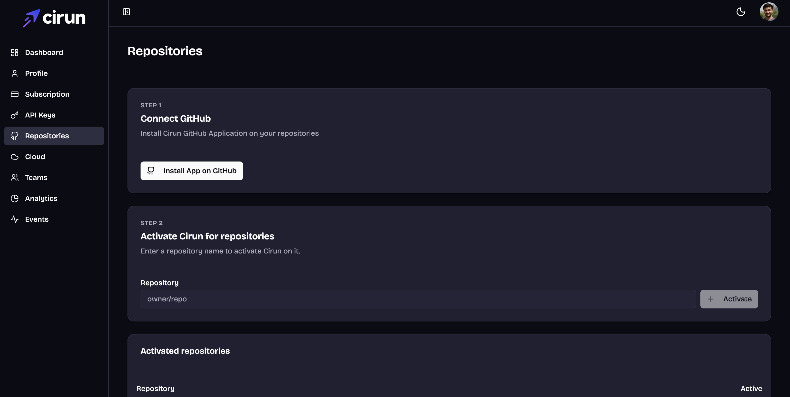
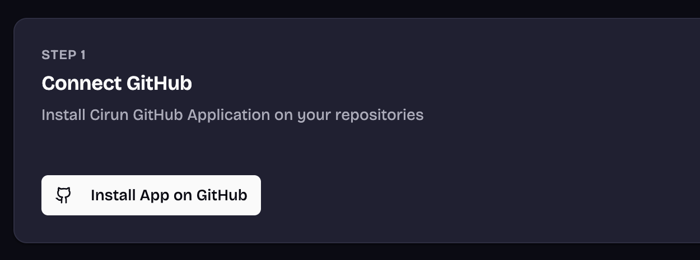
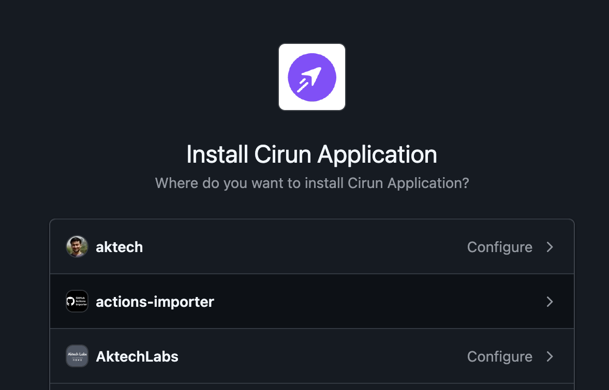
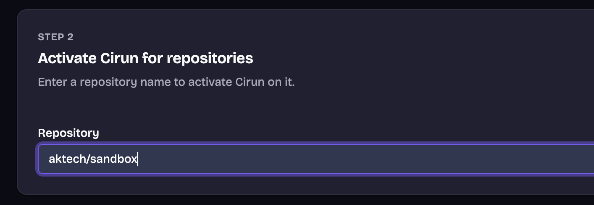
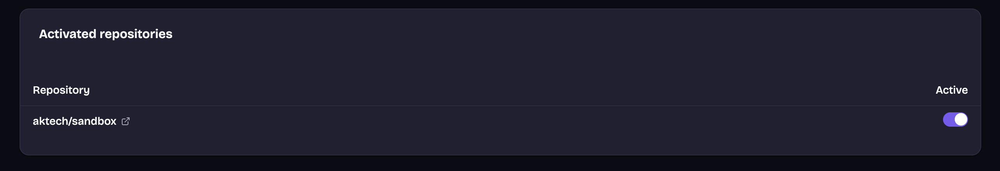

<head>
  <body className="other-extra-body-class" />
  <title>Cirun Documentation</title>
  <meta data-rh="true" name="twitter:card" content="summary_large_image" />
  <meta name="twitter:site" content="https://cirun-docs-test.netlify.app" />
  <meta name="twitter:title" content="Cirun Docs" />
  <meta name="twitter:description" content="Cirun Documentation - GitHub Actions on Your Cloud" />
  <meta name="twitter:image" content="https://cirun-docs-test.netlify.app/img/cirun-summary-image-v4.png" />
</head>

Get Started with Cirun by going to Cirun.io <https://cirun.io>

1. Login to <https://cirun.io>
2. Click on Dashboard on the landing page
3. Click on Repositories Section on the left.

   

4. Connect Cirun to GitHub to install the GitHub Application on the repositories you'd like to use Cirun on.

   

   

5. Activate Cirun for the repositories where you would like to run Cirun by adding the repository name and clicking on Activate.

   
   

6. Click on the Cloud section on the left and add credentials for the cloud you want to run GitHub Action runners on.

7. Create a `.cirun.yml` (please note it's `.cirun.yml` NOT `cirun.yml`) in the repository, see Reference docs.

8. Change the `runs-on:` param in your GitHub Actions workflow file to:
   ```yml
   runs-on: "cirun-label-defined-in-your-.cirun.yml-file--${{ github.run_id }}"
   ```

9. Now push anything to the repository, your actions should be running on your Cloud.
