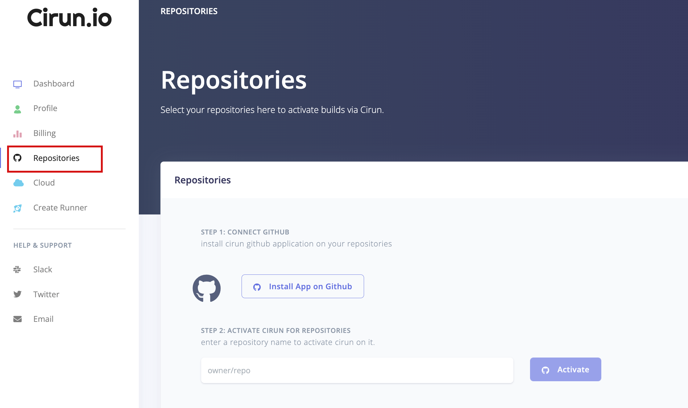
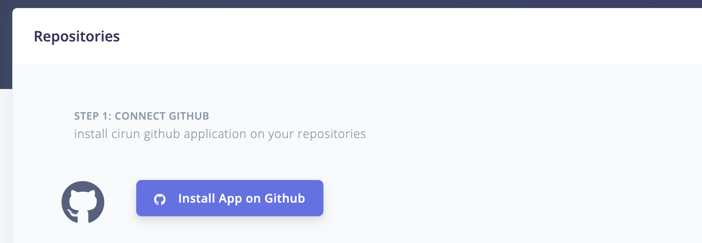
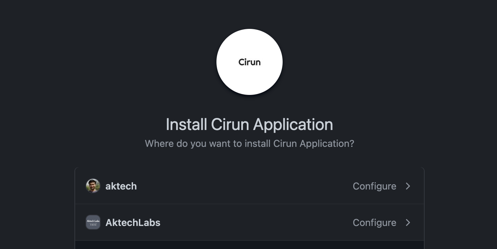
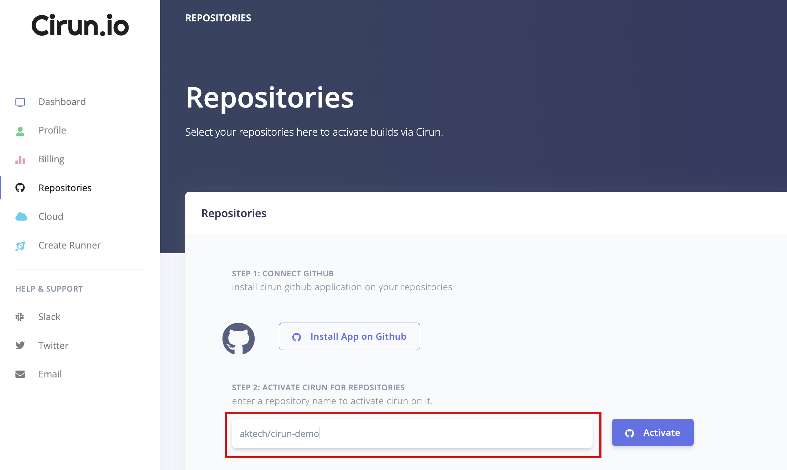
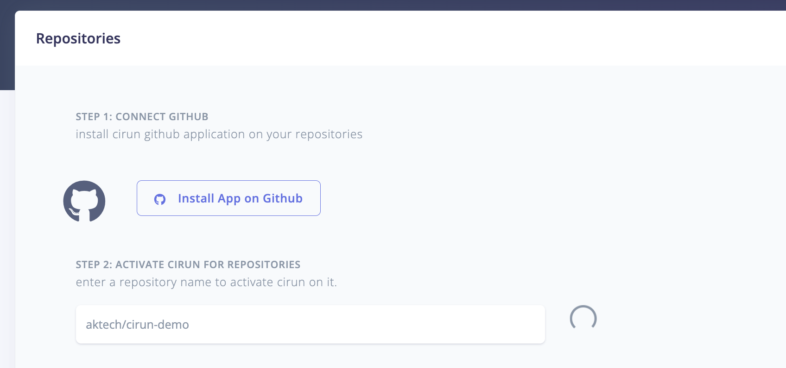
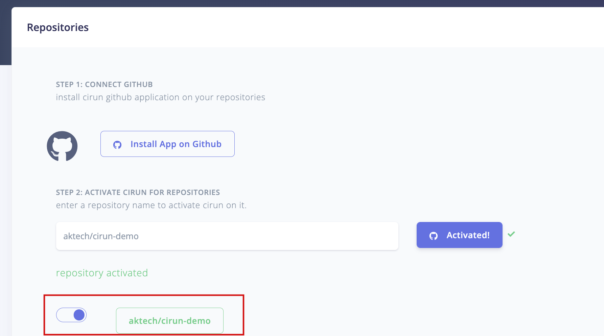

<head>
  <body className="other-extra-body-class" />
  <title>Cirun Documentation</title>
  <meta data-rh="true" name="twitter:card" content="summary_large_image" />
  <meta name="twitter:site" content="https://cirun-docs-test.netlify.app" />
  <meta name="twitter:title" content="Cirun Docs" />
  <meta name="twitter:description" content="Cirun Documentation - GitHub Actions on Your Cloud" />
  <meta name="twitter:image" content="https://cirun-docs-test.netlify.app/img/cirun-summary-image-v4.png" />
</head>

Get Started with Cirun by going to [Cirun.io](https://cirun.io)

- Login to <https://cirun.io>
- Click on Repositories Section on the left.

  

- Install the GitHub Application on the repositories, you would like Cirun.

  

  

- Activate Cirun for the repositories where you would like to run Cirun by adding the repository name and clicking on Activate.

  
  
  

- Click on the Cloud section on the left and add credentials for the cloud you want to run GitHub Action runners on.

- Create a `.cirun.yml` in the repository, see [Reference docs](https://docs.cirun.io/reference/).
:::note
It's `.cirun.yml` NOT `cirun.yml`
:::

- Now push anything to the repository, your actions should be running on your Cloud.
