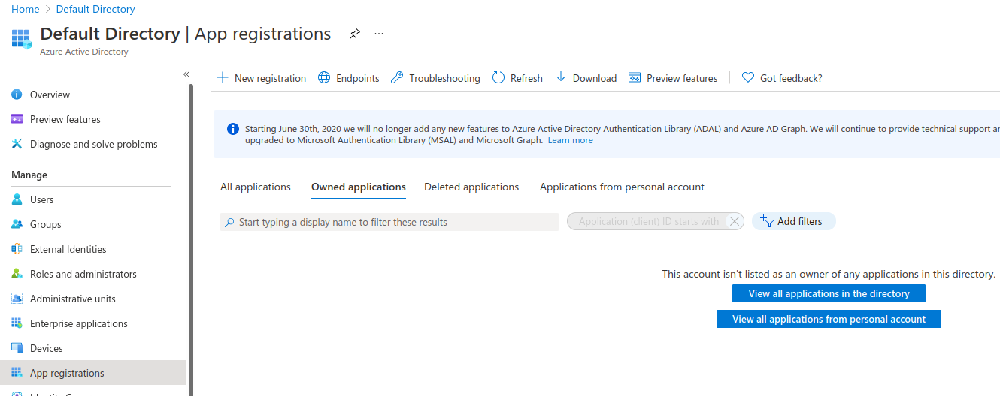
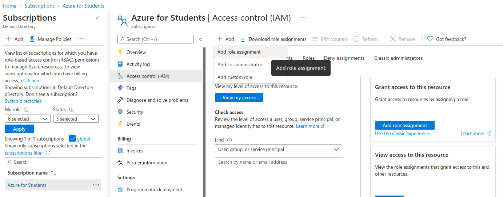

# Azure

If you're using Azure as a cloud provider for Cirun, this is how you would give
Cirun access to your Azure, for it to be able to create runners.

Authentication using Azure is divided into two parts

### Register Application

- Goto `Azure Active Directory` from your Azure dashboard.
- Register a new application in App registrations with name "cirun" and give it "Accounts in any organizational directory (Any Azure AD directory - Multitenant)" access.
  
- Now copy the "Application (client) ID", "Directory (tenant) ID"
- Click on the "Certificates & secrets" and create a new client secret and copy the "Value"
- Now goto Subscriptions from Home and copy subscription id

### Give access to Application

- Click on your Subscriptions, goto Access control(IAM), click on "Add role assignment" then select "Contributor", click on "Select members" and search for "cirun" and select it.
  
- Click on "Review and assign"
- Paste your "Subscription ID", "Tenant ID", "Client ID" and "Client Secret" in the Cirun Dashboard.
