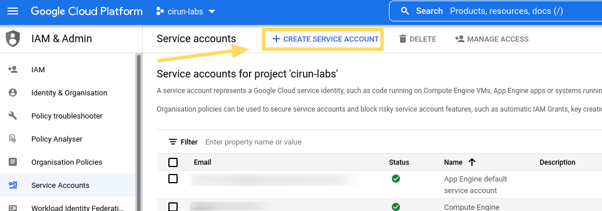
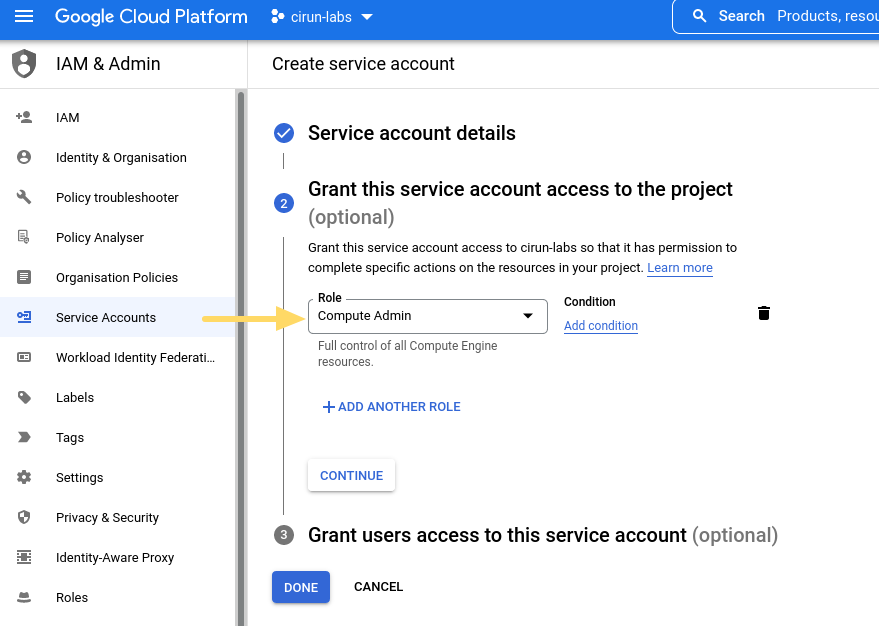
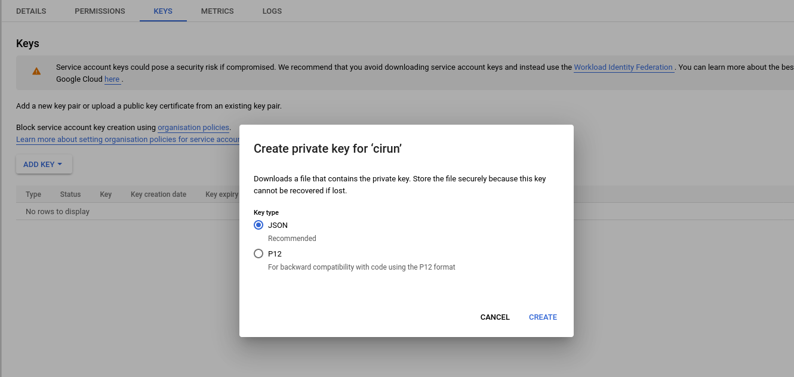
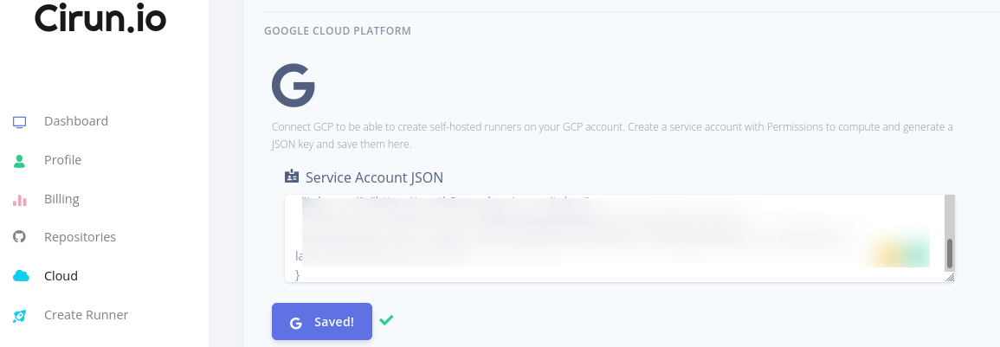
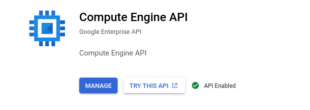

# Google Cloud Platform

<head>
  <body className="other-extra-body-class" />
  <title>Cirun Docs</title>
  <meta data-rh="true" name="twitter:card" content="summary_large_image" />
  <meta name="twitter:site" content="https://docs.cirun.io" />
  <meta name="twitter:title" content="Cirun Documentation" />
  <meta name="twitter:description" content="Cirun Documentation - Cloud Authentication." />
  <meta name="twitter:image" content="https://docs.cirun.io/img/cirun-summary-image-v4.png" />
</head>

If you're using GCP as a cloud provider for Cirun, this is how you would give
Cirun access to your GCP, for it to be able to create runners.

- Create a Service Account with Compute Engine Admin Permissions
  
  
- Add a new key pair to your created service account, download JSON file, and paste the JSON content on the Cirun dashboard
  
  
- Visit <https://console.cloud.google.com/apis/library?project> and search compute engine and enable the API.  
  

### GPU

If you need to be able to create GPU enabled runners, make sure to request
Google to increase your quota for GPUs, its 0 by default. See <https://cloud.google.com/compute/quotas#gpu_quota>
