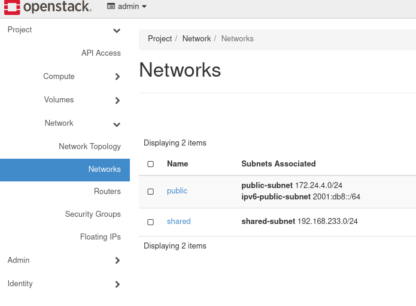
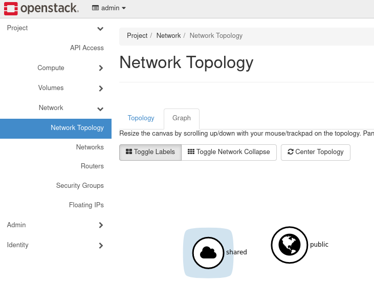
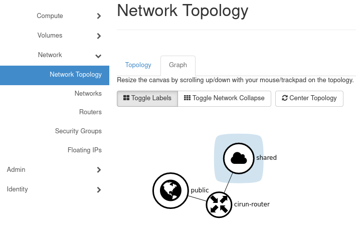
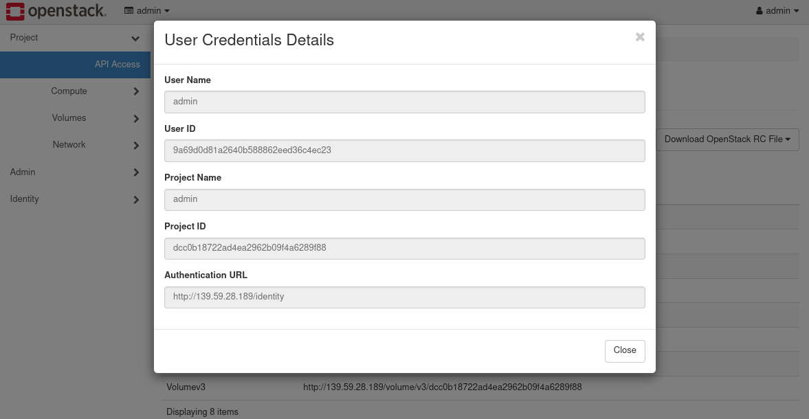
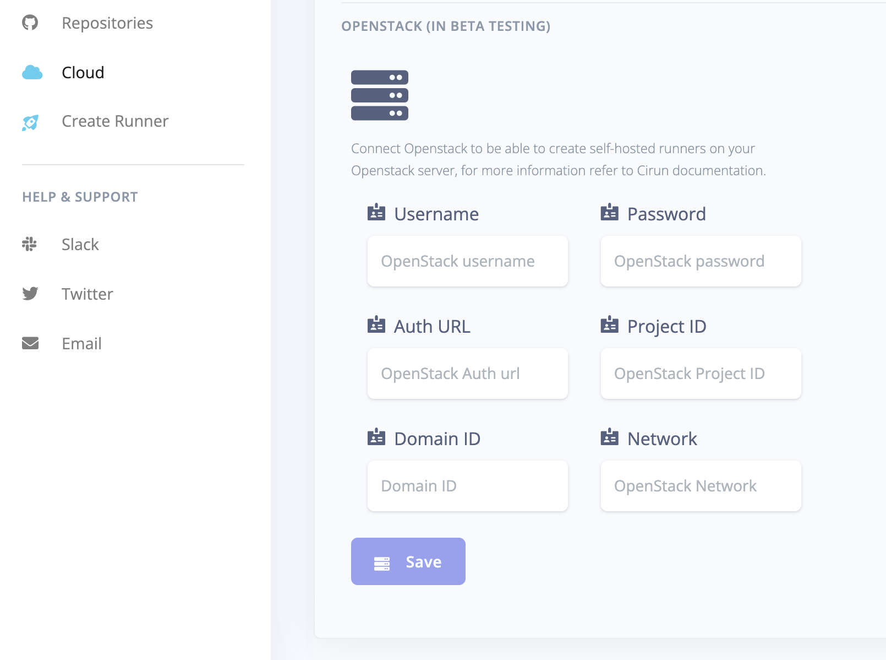

# OpenStack

If you're using OpenStack as a cloud provider for Cirun, this is how you would give
Cirun access to your OpenStack, for it to be able to create runners.

For authentication in OpenStack first, we need to build OpenStack.

(Skip this step if you already have an OpenStack installation up and running.)

### Setup

:::caution
Setting up OpenStack will make substantial changes to your system during installation. Only run it on servers or virtual machines that are dedicated to this purpose. The virtual machine will need a multi-core processor and at least 8GB of memory and 100GB of disk space to run smoothly. It has been tested on DigitalOcean(8GB/4vcpu/160GB) and GoogleCloud(n1-standard-4) virtual machines.
:::

We will use DevStack to build OpenStack, it is a series of extensible scripts used to quickly bring up a complete OpenStack environment. Use the following steps to build it or you can also follow the documentation available at the [Openstack website](https://docs.openstack.org/devstack/latest).

#### Add new user

Devstack should be run as a non-root user with sudo permissions enabled. To create a new user named stack or anything you prefer and give it sudo privileges use the below commands

```bash
sudo useradd -s /bin/bash -d /opt/stack -m stack
echo "stack ALL=(ALL) NOPASSWD: ALL" | sudo tee /etc/sudoers.d/stack
sudo -u stack -i
```

#### Download DevStack

```bash
git clone https://opendev.org/openstack/devstack && cd devstack
```

#### Create a local.conf

Create a local.conf file with four passwords preset at the root of the devstack git repo. Make sure to change the passwords.

```bash
[[local|localrc]]
ADMIN_PASSWORD=secret
DATABASE_PASSWORD=$ADMIN_PASSWORD
RABBIT_PASSWORD=$ADMIN_PASSWORD
SERVICE_PASSWORD=$ADMIN_PASSWORD
```

#### Start the install

```bash
./stack.sh
```

This will take a 15 - 20 minutes, largely depending on the speed of your internet connection. Many git trees and packages will be installed during this process. After the setup has completed log in to the web UI by pointing your browser to the following URL `http://10.20.20.1` or `http://<ip of vm>`. The username is admin and password will be the password you kept while creating local.conf.

### Router setup (For internet access in the VM)

In OpenStack, you need to manually set up the network so that the VM that is/will be created has an internet connection. To set up the router follow the below steps.

- When you will open the network section from the sidebar on the OpenStack dashboard you will see two networks public and shared. The public is the public net and we can connect to it by creating a router.



- The network topology will look like this



- To connect the VM to the internet we need to connect a Router to the public network and then connect that router to the network with which our VM is/will be connected(by default it is shared).

- Goto Router from the side panel and create a router, under the External Network select `public`.


- Go inside the router and add an interface by clicking `Add Interface` and selecting the Subnet(shared) with which your VM is/will be connected.


- After completing the above steps the final network topology will look like



- Now if you will create a VM then you will be able to ping any IP.

### Authentication

- From dashboard go to `API Access` and click on `View Credentials`



- Copy the following
    - `User Name`
    - `Authentication URL` and
    - `Project ID`

and paste these credentials in the Cirun dashboard in the Cloud section.



- `Network` : In the network section you need to add the network you created (say `shared`) above unless
  you already have an existing network which you would like to use.

- `Domain ID`: In the Domain ID section you need to write `default` unless you already have a
  domain, which you can find out from "Identity > Domain" section in the OpenStack dashboard. Use
  the Domain ID of the Domain you would like to use.

- `Password`: The password for OpenStack dashboard for the given user.

* Example Values for OpenStack Credentials

```yaml
User Name: admin
Password: supersecretpassword1234
Authentication URL: http://159.223.166.1/identity
Project ID: c4c175d2801237c198153545db21e6ef
Domain ID: 63a9cbe8cd3d12e112786c990f93ecd0
Network: shared
```
