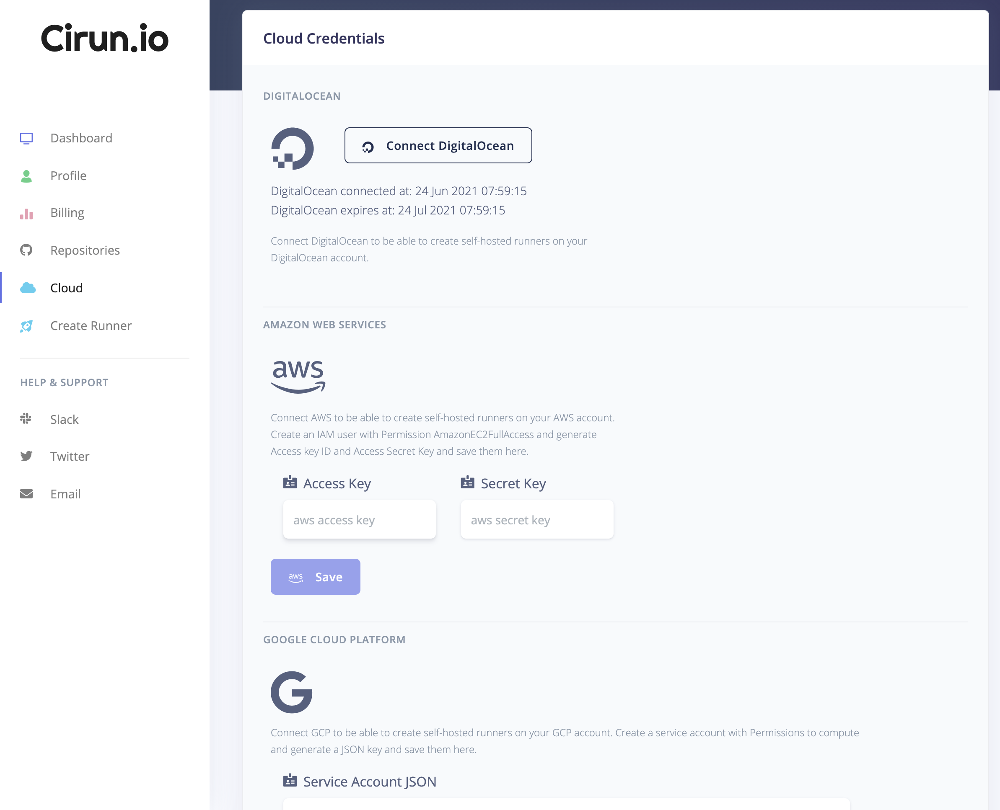

# Cloud Authentication

## Google Cloud Platform

- Create a Service Account with Compute Engine Admin Permissions
- Make to enabled Compute Engine API: <https://cloud.google.com/apis/docs/getting-started#enabling_apis>
- Paste you Service Account JSON in the "Cloud" Tab of Cirun Dashboard under GCP section.

### GPU

If you need to be able to create GPU enabled runners, make sure to request
Google to increase your quota for GPUs, its 0 by default. See <https://cloud.google.com/compute/quotas#gpu_quota>

## Amazon Web Services

- Create an IAM account to EC2Admin Permissions
- Generate an "Access Key" and "Secret Key" for that IAM user
- Paste your "Access Key" and "Secret Key" in the "Cloud" Tab of Cirun Dashboard under AWS section.

## DigitalOcean

Just click on Connect DigitalOcean button in the Cloud in the Cirun Dashboard.

# Cloud Login Page

