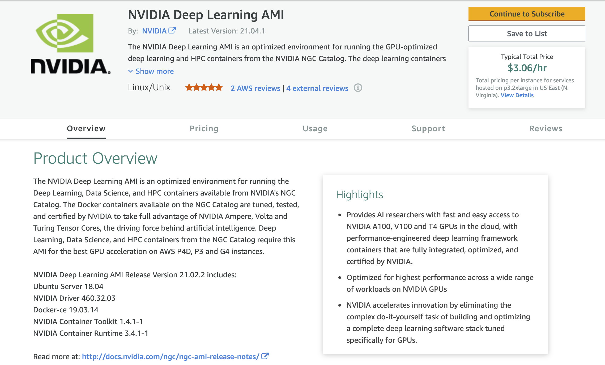
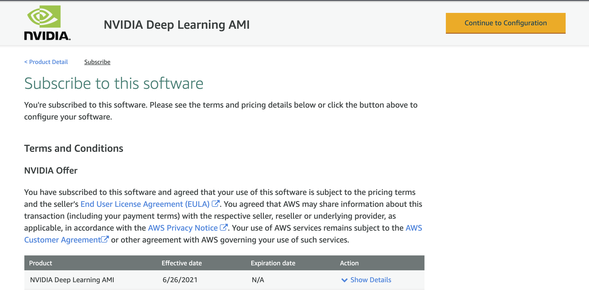
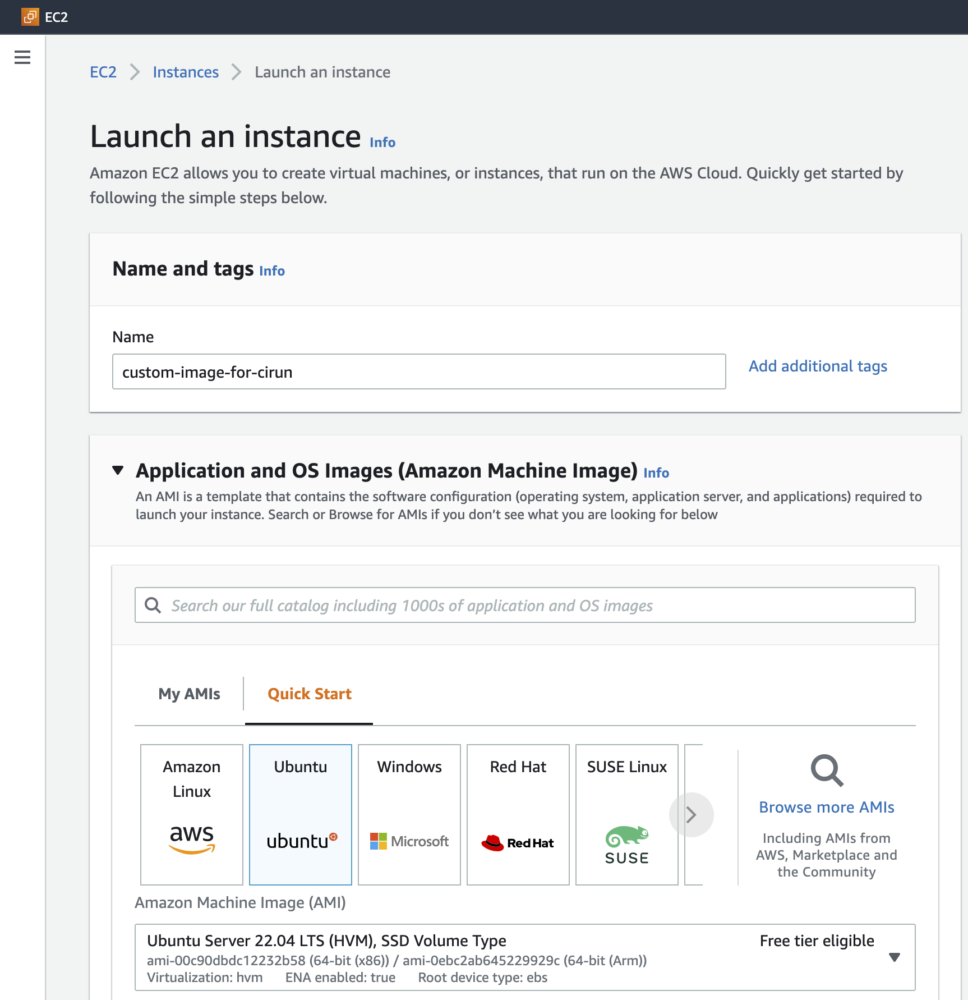
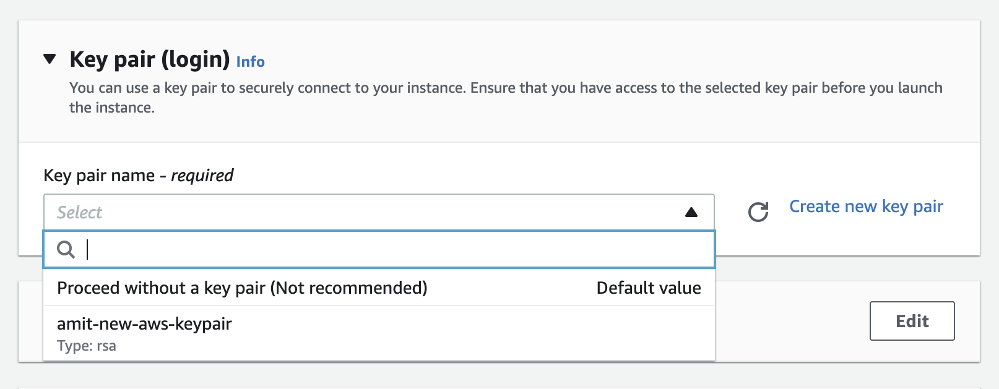
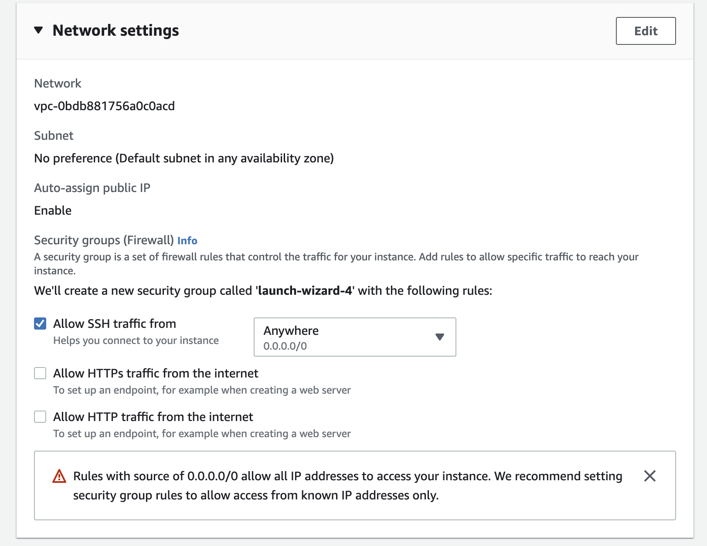
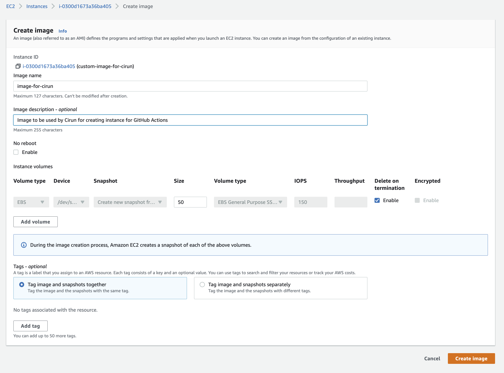
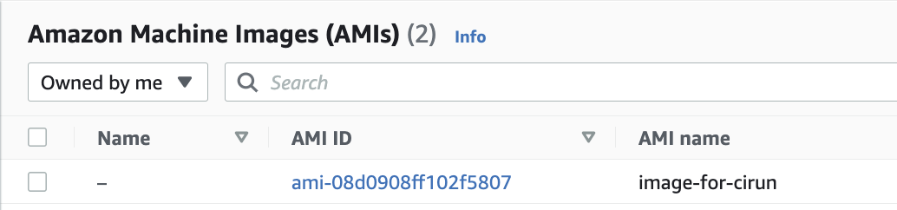

# Custom Images for Runner

You can use custom images for your runners as well. One use case for that
is you want pre installed packages.


## AWS Custom AMI

One of the most common applications of Cirun is the ability to run CI on
custom VM images on cloud. One common applcation for the same is using GPU
enabled machine with NVIDIA VM image for running GPU related things in the CI

AWS Marketplace has many such useful images, which can  help make your
CI faster.

### Using Prebuilt Images: NVIDIA Deep Learning AMI

Let's take an example of using an NVIDIA Deep Learning AMI for GPU enabled
runners.

To use any AMI (Amazon Machine Image) in your `.cirun.yml`, you need two things:

```{admonition} Note
1. The AMI ID for the runner in that region (default region is `eu-west-1`).
2. Accept Terms and condition for the AMI.
```

Here are the steps to achieve the above.

1. Go to [AWS Marketplace](https://aws.amazon.com/marketplace) and Search for "**NVIDIA Deep Learning AMI**".
2. In the search results click on the "**NVIDIA Deep Learning AMI**".

   

3. Click on "**Continue to Subscribe**" on the top right to accept terms and condition. (You need to be
   logged in to your AWS account for this). You should see the following page
   after subscribing.
   

4. Click on "**Continue to configuration**" button on the top right.
   

5. Here you can see the Ami Id of the image, which now you can use in your `.cirun.yml` as following:
   ```yaml
       machine_image: ami-00ac0c28c01352e53
       region: eu-west-1  # this is default region anyways (only required if using an AMI ID from different region)
   ```
   

In the above photo we can see the AMI ID for "**NVIDIA Deep Learning AMI**" in the Ireland region (`eu-west-1`).

```{note}
Pricing: This AMI is free to use, the pricing you see on the right is the price for the instance
not for the AMI.
```

### AWS Marketplace NVIDIA Deep Learning AMI `.cirun.yml`

```{admonition} Note
:class: error
It is important to accept terms and conditions of the AMI you want to use, using
the process described above, otherwise you'll not be able to provision the
runner.
```

```yaml
# Self-Hosted Github Action Runners on AWS via Cirun.io
# Reference: https://docs.cirun.io/reference/yaml.html
runners:
  - name: gpu-runner
    # Cloud Provider: AWS
    cloud: aws
    instance_type: g4dn.xlarge
    # NVIDIA Deep Learning AMI from AWS Marketplace
    # https://aws.amazon.com/marketplace/pp/prodview-e7zxdqduz4cbs
    machine_image: ami-00ac0c28c01352e53
    preemptible: false
    labels:
       - cirun-gpu-runner
```

### AWS: Building Custom Images with user modification

You can also build custom images on AWS on top of already existing images and
install packages and custom configuration and use that image for Cirun runner
on GitHub Actions. Here are the steps for same:

Launch an instance on AWS (following the steps mentioned below):

1. Set the name for new instance and select the image for operating system:

   

2. Select Instance type (the size which is good enough for your CI job):

   

3. Select a keypair if you have one already or create a new one and make sure to save the private key generated, this will help you login to the created machine:

   

4. Select allow SSH traffic in the "Network" section and add storage in the
"Configure storage" section (this storage will be available to your CI job,
make sure to put enough space here, **the default storage is quite low**)

   
   

5. Now click on "launch instance" to launch the instance
   
   

6. After the instance has been created now click on the created instance (in the instances section of the EC2 Dashboard) and copy the "Public IPv4 address".

   

7. SSH into the machine (using the private key created using step 3) and install any packages tools you would like it to be available to the CI job.

8. Now click on the Actions > Image and templates > Create Imge to create image of the instance we just created.

   

   

   Fill in image name, description and volume size and hit "Create Image"

9. Copy AMI ID for using with Cirun: Now go to EC2 Dashboard > Images > AMIs and copy the "AMI ID" and use it in your `.cirun.yml` file, so that the instances created will be based in this image.

   

## Azure Custom Images

For making custom images in Azure user needs to just capture an existing VM and create the image in a resource group.

### Nginx Ubuntu custom image

Let's take an example of how to create a custom image on Azure. We will make a ubuntu image with Nginx pre-installed. Then we will create a VM using this custom image. Here are the steps to achieve the above.

1. Create a ubuntu VM in a new or existing resource group from the Azure dashboard.
2. SSH into the VM and install Nginx using.
   ```
   sudo apt install nginx
   ```
3. Now capture the VM using the capture button inside the VM. "For Share image to Shared image gallery" option select "No, capture only a managed image".
4. Also, tick the checkbox having the option "Automatically delete this virtual machine after creating the image".
5. Change the name of VM and click on review and create.
6. After the image has been created go to the resource group in which you have created the image. Your image will be present here.
7. To list all custom images using Azure CLI use
   ```
   az image list
   ```
8. The above command shows all the custom images available on your Azure. It also shows "id" for all custom images. This is the parameter we use to make VM with a custom image.

### Azure custom image vm `.cirun.yml`

The .cirun.yml for above custom image will look like

```yaml
# Self-Hosted Github Action Runners on Azure via Cirun.io
# Reference: https://docs.cirun.io/reference/yaml.html
runners:
  - name: azure-runner
    # Cloud Provider: Azure
    cloud: azure
    instance_type: Standard_DS1_v2
    machine_image: /subscriptions/d74a1d71-99ffab4a5/resourceGroups/myResourceGroup/providers/Microsoft.Compute/images/myCustomImage
    preemptible: false
    labels:
       - cirun-gpu-runner
```

## Openstack Custom Images

In OpenStack only cirros image is provided by default, this image is not suitable for the runners to run the jobs. To build a custom image we need to download a cloud image and create an Openstack image from it. Here we will create a `ubuntu-20.04` cloud image.

### Ubuntu image

Ubuntu cloud images are available at [https://cloud-images.ubuntu.com](https://cloud-images.ubuntu.com). You can create any image but for this tutorial, we will use `focal` cloud images.

- Open the terminal and make sure you are `stack` or the user that build OpenStack
```bash
sudo -u stack -i
```
- Cd into devstack and authenticate yourself
```bash
cd devstack && source openrc admin
```
- Go to [https://cloud-images.ubuntu.com/focal/current](https://cloud-images.ubuntu.com/focal/current) and copy the url of `focal-server-cloudimg-amd64.img`
- Download the image by using wget <url of focal-server-cloudimg-amd64.img>
```bash
wget https://cloud-images.ubuntu.com/focal/current/focal-server-cloudimg-amd64.img
```
- After the image has been downloaded you can create an image named `ubuntu-20.04` with disk type `qcow2` using the below command
```bash
openstack image create --file focal-server-cloudimg-amd64.img --disk-format qcow2 ubuntu-20.04
```
- Now if the above steps were fine you would have created an image named `ubuntu-20.04`. You can verify it using `openstack image list` or visiting the image section on the dashboard.
